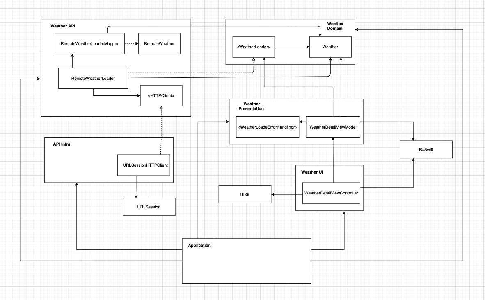

# RandomWeather

## Weather Loader Feature Specs

### Story: Display the weather of a random location

### Narrative #1

```
I want the app to display the weather of a random location
So I can have some fun checking the weather of other places
```

#### Scenarios (Acceptance criteria)

```
Given the customer has connectivity
When the customer opens the app to see a random locations weather
Then the app should display the weather for such random location
```

## Use Cases

### Load the weather Use case

#### Data:
- URL

#### Primary course (happy path):
1. Execute Load Weather with above data
2. System downloads data from url
3. System validates downloaded data
4. System creates weather info from valid data
5. System delivers weather info

#### Invalid data – error course (sad path):
1. System delivers invalid data error

#### No connectivity – error course (sad path):
1. System delivers connectivity error.

---

## Architecture


The architecture is based on a modular design following the clean architecture and SOLID principles. The dependency between modules is from the outside in, which means inner modules don't depend on outter modules.
There are 6 modules:
1. Domain (Business logic)  
2. API (Application logic - Use case)
3. Presentation (Presentation logic)
4. UI 
5. API Infra
6. Application

There is also a seventh module which contains some compontes that can be used from other modules.

### Domain (Business logic)
It contains the data structure that represents the business needs and the WeatherLoader protocol.

### API (Application logic - Use case)
This module represents the use case. The RemoteWeatherLoader dependes on the HTTPClient protocol which can be implemented by a networking infraestructure detail. 
It also holds a dependency to the RemoteWeatherLoaderMapper which is in charge of mapping the Data response into a RemoteWeather data structure and then obtaining the business model from it.

### Presentation (Presentation logic)
The main component of the presentation layer is the WeatherDetailViewModel. This component is in charge of obtaining the domain model from the use case and turn it into a more pleasant data to present to the user. Its was built follwowing the binding principles so the UI can be updated everytime the ViewModel updates its properties without relying on manual actions.
There is algo a WeatherLoaderErrorHandling protocol in order to translate the use case errors into user friendly error messages. The class which conforms to this protocol will be created on the Application module, so we can decouple as much as possible the presentation layer from implementation details of the use case such as networking error types.

### UI
The UI contains a WeatherDetailViewController with its Storyboard. Pretty basic UIViewController which has a pull to refresh feature.

### API Infra
This is where the networking implementation details  can be found. URLSessionHTTPClient implements the HTTPClient protocol and will be injected into the RemoteWeatherLoader on the composition/Application layer. Our components should no be depending on infraestructure details, that's why we have a whole module for that. 

### Application
This module is where the composition of all the modules is being made. This module is the only one that belongs to our app, the rest could be external frameworks that can be easily compose without problems. And we can use them in different apps. 
The Components class is the one in charge of the creation and compositions of  the different modules. We also have some implementation details that cannot be on any other module because they also depend on other implementation details (RandomURLGenerator and RemoteWeatherLoaderErrorHandling) that might only be related to the app.

This architecture allows to test on isolation all the modules thanks to the low coupling between modules. We can also compose modules pretty easily, even extending new functionality like for example adding local cache when there is no internet connectivity.
